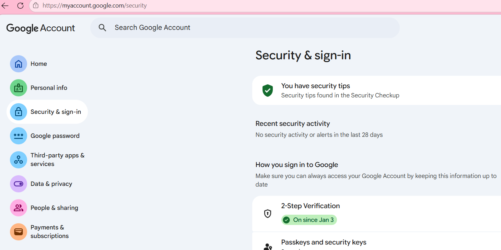
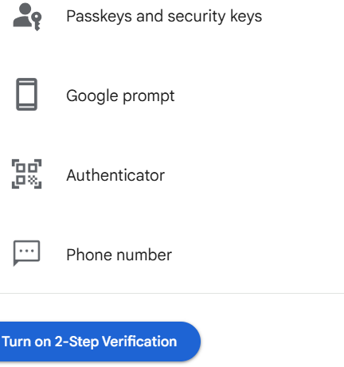

### SMTP - Simple Mail Transfer Protocol
It allows Python programs to:

- connect to a mail server

- login to an email account

- send emails programmatically

### Gmail Settings
Normal Gmail password won’t work.
You must create App Password.
- setup Gmail for email sending 

1. Go to Google account
2. Security
3. Enable 2-Step Verification
4. After Enabling 2FA,got to myaccounts.google.com/apppasswords
5. Generate App Password
6. Use that 16- character password in Python

## Screenshots
|  |  |

- [X] follow the code inside the folder.

### For Email integration with flask check the repository
Project-1:
✅ OTP Email Login [OTP_Email_Login]

Project-2:
✅ To-Do App with Database [TO-DO_App]

Project-3:
✅ URL Shortener [URL_Shortner]

